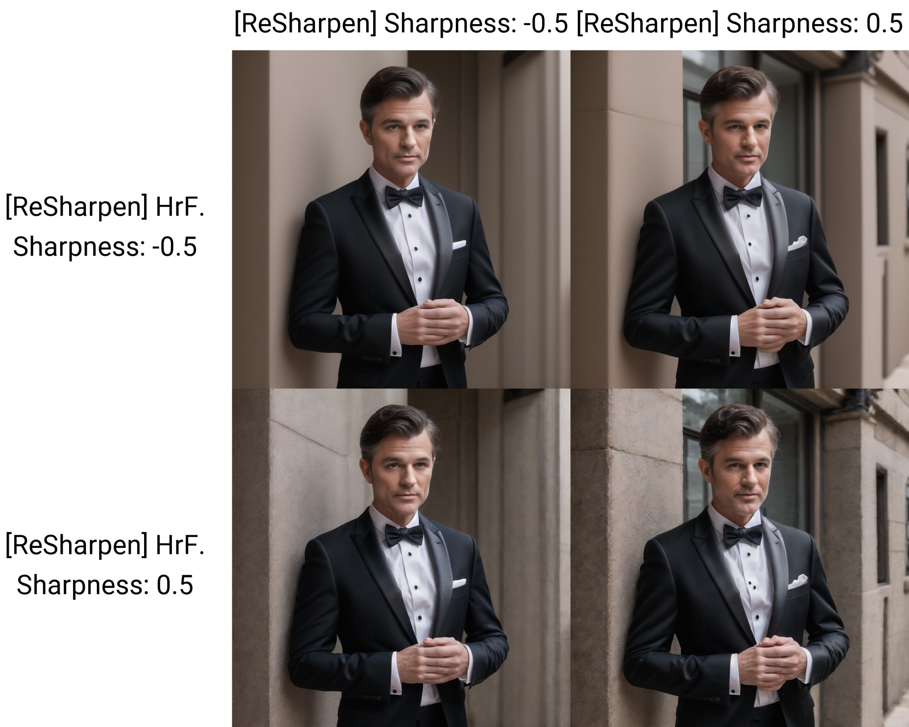

# SD Webui ReSharpen
This is an Extension for the [Automatic1111 Webui](https://github.com/AUTOMATIC1111/stable-diffusion-webui), which allows you to increase or decrease the amount of *details* of the generation during the Stable Diffusion pipeline.

> **ie.** This is not just a postprocessing filter

## How to Use
There is simply a slider that controls the "sharpness" of the images, defaulting to 0.
- **Positive** values cause the images to be **noisy**
- **Negative** values cause the images to be **blurry**

> Though, don't actually use values too close 1 or -1 as it will become distorted

For `txt2img`, there is also a second slider for the `Hires. Fix` pass.
You can set positive for the normal pass and negative for the hr pass, or vice versa, for some interesting effects.

There is also an advanced scaling setting, allowing you to adjust the strength throughout the process *(**eg.** lower the sharpness towards the end)*.

> This Extension is disabled during the [ADetailer](https://github.com/Bing-su/adetailer) phase

**Note:** `Ancestral` samplers *(**eg.** `Euler a`)* do **not** work. Tested and confirmed to work for both `Euler` and `DPM++ 2M Karras`.

## Samples

<table>
    <thead align="center">
        <tr>
            <td>Sharpness</td>
            <td><b>-0.5</b></td>
            <td><b>-0.25</b></td>
            <td><b>0.0</b></td>
            <td><b>0.25</b></td>
            <td><b>0.5</b></td>
        </tr>
    </thead>
    <tbody align="center">
        <tr>
            <td>Result</td>
            <td></td>
            <td></td>
            <td></td>
            <td></td>
            <td></td>
        </tr>
    </tbody>
</table>

## How does it work?
I initially wrote this Extension to try speeding up the Diffusion process.
Since the latent noises gradually converges to around 0,
I tried to see if I can just add the delta between the current step and the previous step, perhaps multipled by a scaler,
to the current Tensor, in order to help it reaches 0 faster.
However, after fiddling around for a week, I still couldn't get it to consistently produce an actually better result.
So I gave up on the original idea.

Though in the process, I also found out this "sharpening" interaction. If I had to guess,
since the Diffusion is a denoising process, if I add the delta again, then it will overly denoise to create a blurry image;
if I subtract the delta, then it will basically add the noise back to create a noisy image.

## To Do
- [X] Generation InfoText
- [X] Pasting InfoText Support
- [X] X/Y/Z Plot Support
- [X] Scaling Support
